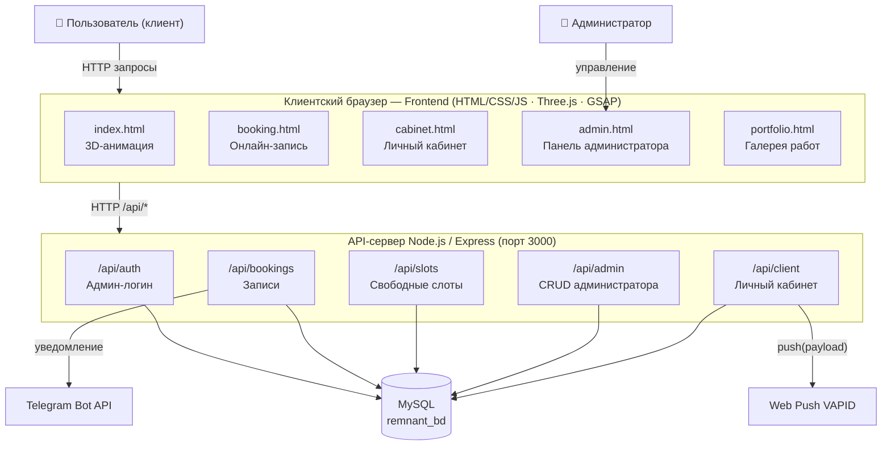

# Рисунок 3 — Функциональная схема веб-приложения REMNANT

```mermaid
graph TD
    USER["👤 Пользователь (клиент)"]
    ADMIN["🔧 Администратор"]

    subgraph FRONTEND["Клиентский браузер — Frontend (HTML/CSS/JS · Three.js · GSAP)"]
        INDEX["index.html\n3D-анимация"]
        BOOKING["booking.html\nОнлайн-запись"]
        CABINET["cabinet.html\nЛичный кабинет"]
        ADMINP["admin.html\nПанель администратора"]
        PORTFOLIO["portfolio.html\nГалерея работ"]
    end

    subgraph API["API-сервер Node.js / Express (порт 3000)"]
        R_AUTH["/api/auth\nАдмин-логин"]
        R_BOOK["/api/bookings\nЗаписи"]
        R_SLOTS["/api/slots\nСвободные слоты"]
        R_ADMIN["/api/admin\nCRUD администратора"]
        R_CLIENT["/api/client\nЛичный кабинет"]
    end

    DB[("MySQL\nremnant_bd")]
    TG["Telegram Bot API"]
    PUSH["Web Push VAPID"]

    USER -->|"HTTP запросы"| FRONTEND
    ADMIN -->|"управление"| ADMINP

    FRONTEND -->|"HTTP /api/*"| API

    R_AUTH --> DB
    R_BOOK --> DB
    R_BOOK -->|"уведомление"| TG
    R_SLOTS --> DB
    R_ADMIN --> DB
    R_CLIENT --> DB
    R_CLIENT -->|"push(payload)"| PUSH
```
