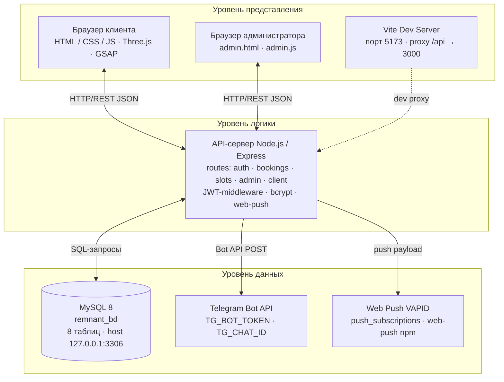

# Рисунок 4 — Структурная схема веб-приложения REMNANT

```mermaid
graph TB
    subgraph L1["Уровень представления"]
        BC["Браузер клиента\nHTML / CSS / JS · Three.js · GSAP"]
        BA["Браузер администратора\nadmin.html · admin.js"]
        VITE["Vite Dev Server\nпорт 5173 · proxy /api → 3000"]
    end

    subgraph L2["Уровень логики"]
        EXPRESS["API-сервер Node.js / Express\nroutes: auth · bookings · slots · admin · client\nJWT-middleware · bcrypt · web-push"]
    end

    subgraph L3["Уровень данных"]
        MYSQL[("MySQL 8\nremnant_bd\n8 таблиц · host 127.0.0.1:3306")]
        TG["Telegram Bot API\nTG_BOT_TOKEN · TG_CHAT_ID"]
        WP["Web Push VAPID\npush_subscriptions · web-push npm"]
    end

    BC <-->|"HTTP/REST JSON"| EXPRESS
    BA <-->|"HTTP/REST JSON"| EXPRESS
    VITE -.->|"dev proxy"| EXPRESS

    EXPRESS <-->|"SQL-запросы"| MYSQL
    EXPRESS -->|"Bot API POST"| TG
    EXPRESS -->|"push payload"| WP
```
