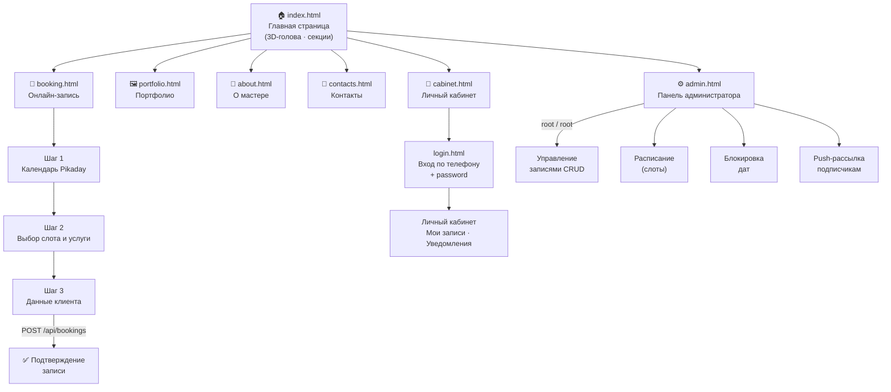

# Рисунок 5 — Карта пользовательского интерфейса REMNANT

```mermaid
graph TD
    HOME["🏠 index.html\nГлавная страница\n(3D-голова · секции)"]

    HOME --> BOOKING["📅 booking.html\nОнлайн-запись"]
    HOME --> PORTFOLIO["🖼️ portfolio.html\nПортфолио"]
    HOME --> ABOUT["👤 about.html\nО мастере"]
    HOME --> CONTACTS["📍 contacts.html\nКонтакты"]
    HOME --> CABINET["🔐 cabinet.html\nЛичный кабинет"]
    HOME --> ADMIN["⚙️ admin.html\nПанель администратора"]

    BOOKING --> S1["Шаг 1\nКалендарь Pikaday"]
    S1 --> S2["Шаг 2\nВыбор слота и услуги"]
    S2 --> S3["Шаг 3\nДанные клиента"]
    S3 -->|"POST /api/bookings"| CONFIRM["✅ Подтверждение\nзаписи"]

    CABINET --> LOGIN["login.html\nВход по телефону\n+ password"]
    LOGIN --> CAB_DASH["Личный кабинет\nМои записи · Уведомления"]

    ADMIN -->|"root / root"| ADM_BOOKS["Управление\nзаписями CRUD"]
    ADMIN --> ADM_SCHED["Расписание\n(слоты)"]
    ADMIN --> ADM_BLOCK["Блокировка\nдат"]
    ADMIN --> ADM_PUSH["Push-рассылка\nподписчикам"]
```
